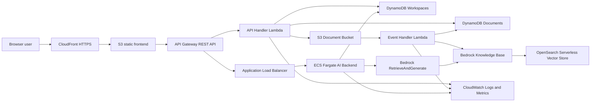

# W7 Evidence Pack - DocHub AI

## 1. Cover

| Field | Value |
| --- | --- |
| Group | Group 5 |
| Members | ACTION REQUIRED: add member names |
| Domain | ProductivityTech |
| Product | DocHub AI |
| Live URL | ACTION REQUIRED: add CloudFront URL after deploy |
| API URL | ACTION REQUIRED: add API Gateway `prod` invoke URL after deploy |
| GitHub repo | ACTION REQUIRED: add public repository URL |
| Total spend | ACTION REQUIRED: add final Cost Explorer total before demo |

DocHub AI is a multi-tenant document hub. Users create workspaces, upload PDF/DOCX documents, wait for Bedrock Knowledge Base ingestion, and ask grounded questions against documents in their own workspace only.

## 2. Pitch And Vision

Teams lose time searching contracts, policies, meeting notes, and operating documents. DocHub AI gives each tenant a private workspace where documents become searchable through a Bedrock-backed RAG assistant.

Target users are small teams and internal operations groups that need fast answers from document collections without building a full enterprise search platform. The closest real-world parallel is Harvey AI for legal and enterprise document workflows, but scoped to a lower-cost hackathon SaaS implementation.

The core risk is cross-tenant leakage. The system is designed so tenant context is checked before upload, listing, and chat, while Bedrock retrieval is filtered by workspace metadata.

## 3. Architecture

Final architecture diagram:



Service decision table:

| Capability | Service | Why this choice |
| --- | --- | --- |
| User-facing entry | CloudFront + S3 static hosting | Public HTTPS URL, low cost, no frontend servers to patch. |
| Application compute | API Lambda + ECS Fargate AI backend | Lambda handles lightweight metadata/upload APIs; ECS runs FastAPI AI backend with Docker deployment and stable dependencies. |
| AI / ML feature | Bedrock Knowledge Base + RetrieveAndGenerate | Managed RAG over uploaded documents with metadata filters. |
| Data persistence | DynamoDB | Serverless on-demand tables for workspaces and document status with no idle DB cost. |
| Object storage | S3 | Stores source PDF/DOCX files and Bedrock sidecar metadata. |
| Network foundation | VPC, public/private subnets, security groups, ALB | ECS tasks run in private subnets and are reached through ALB/API Gateway. |
| Identity and access | IAM least privilege + demo tenant header | Required service-to-service least privilege is implemented; demo user auth is intentionally simple for hackathon scope. |
| Observability | CloudWatch dashboard, custom metrics, alarms, Logs Insights | Meets optional Full Observability with evidence-ready dashboard and metrics. |

Conscious trade-offs:

| Decision | Trade-off |
| --- | --- |
| One shared Bedrock Knowledge Base with metadata filtering | Lower fixed cost than per-tenant KB/vector stores, but requires strict server-side tenant and workspace checks. |
| Demo tenant header instead of Cognito | Faster and sufficient under W7 identity rules, but not a production user-auth boundary. Server-side ownership checks remain in place so Cognito/JWT can replace the header later. |
| OpenSearch Serverless vector store | Good Bedrock KB integration, but has a fixed OCU cost. Teardown must happen immediately after demo to avoid ongoing spend. |

## 4. Cost Discipline

Cost screenshots:

| Screenshot | Path | Status |
| --- | --- | --- |
| Day 1 EOD | `docs/evidence/cost_day1.png` | ACTION REQUIRED |
| Day 2 EOD | `docs/evidence/cost_day2.png` | ACTION REQUIRED |
| Friday pre-demo | `docs/evidence/cost_demo_day.png` | ACTION REQUIRED |

Expected top cost drivers:

| Rank | Service | Expected reason |
| --- | --- | --- |
| 1 | OpenSearch Serverless | Fixed OCU cost for Bedrock Knowledge Base vector store. |
| 2 | Bedrock | RAG calls and embedding/model usage during ingestion and chat. |
| 3 | ECS Fargate / ALB | AI backend container and public load balancer for chat API. |

Cost controls implemented:

- DynamoDB uses on-demand billing and point-in-time recovery.
- S3 buckets use lifecycle rules for incomplete multipart uploads and old noncurrent versions.
- CloudFront + S3 avoid a frontend server.
- Lambda is used for lightweight APIs and event processing.
- OpenSearch Serverless is the main teardown priority after demo because it is the largest fixed-cost component.

ACTION REQUIRED: after screenshots are captured, add the actual total and a one-paragraph observation about spend trend.

## 5. Security

IAM and access controls:

| Principal | Scope |
| --- | --- |
| `dochub-lambda-exec-role` | DynamoDB workspace/document access, S3 document object access, Bedrock ingestion job start/read, CloudWatch custom metric publish to namespace `DocHub`. |
| `dochub-ecs-execution-role` | ECS task image pull and CloudWatch log delivery through AWS managed task execution policy. |
| `dochub-ecs-task-role` | DynamoDB workspace ownership read, Bedrock Retrieve/RetrieveAndGenerate/InvokeModel, S3 document read, CloudWatch custom metric publish to namespace `DocHub`. |
| GitHub OIDC deploy role | ACTION REQUIRED: document final deployed role ARN and attach screenshot. |

Data protection:

- Document and frontend buckets block public access.
- S3 object ownership is bucket-owner enforced.
- S3 buckets use server-side encryption.
- S3 bucket policies deny non-TLS access.
- DynamoDB point-in-time recovery is enabled for workspace and document tables.
- CORS is restricted to the deployed frontend origin by default.

Tenant isolation:

- Frontend sends `X-Tenant-Id` for the selected demo tenant.
- API Lambda derives tenant ownership from request header plus DynamoDB workspace records.
- Document list and upload initialization reject workspaces outside the tenant.
- AI backend checks workspace ownership before Bedrock retrieval.
- Bedrock metadata includes `workspace_id` and `tenant_name`; retrieval filters by workspace.

Evidence to attach:

- ACTION REQUIRED: screenshot IAM policy for `dochub-lambda-app-policy`.
- ACTION REQUIRED: screenshot S3 Block Public Access and encryption on document bucket.
- ACTION REQUIRED: screenshot DynamoDB PITR enabled.

## 6. Monitoring

Implemented observability:

| Item | Evidence |
| --- | --- |
| CloudWatch dashboard | `g5-dochub-ai-observability`; screenshot path `docs/evidence/cloudwatch_dashboard.png` |
| Custom metric | `DocHub/DocumentsUploaded` from Event Handler Lambda |
| Custom metric | `DocHub/ChatRequests`, `DocHub/ChatErrors`, `DocHub/ChatLatencyMs` from AI backend |
| Alarm | `dochub-documents-uploaded-spike` |
| Alarm | `dochub-api-lambda-errors` |
| Logs Insights query | `dochub-application-errors` |

ACTION REQUIRED:

1. Deploy Phase 6 Terraform.
2. Run the demo path once: login, create workspace, upload a document, wait for READY, ask one chat question.
3. Confirm `DocumentsUploaded` and `ChatRequests` have data points.
4. Confirm alarms are `OK` or `ALARM`, not `INSUFFICIENT_DATA`.
5. Save screenshots into `docs/evidence/`.

## 6.5 Measurement And Decisions

### Decision 1: Shared Bedrock Knowledge Base With Metadata Filtering

DECISION: Use one Bedrock Knowledge Base for all tenants and isolate retrieval with workspace metadata filters.

ALTERNATIVES CONSIDERED:

- One Knowledge Base per tenant - eliminated because each tenant would require separate vector infrastructure. With OpenSearch Serverless, even one collection has a meaningful fixed OCU cost over 48 hours.
- Plain keyword search in DynamoDB/S3 - eliminated because it cannot answer semantic questions over PDF/DOCX content and would weaken the AI/ML capability.

MEASUREMENT:

- Fixed vector-store count = 1 collection for all demo tenants, measured from Terraform design.
- Cross-tenant server-side checks = 4 paths enforced: workspace list, document list, upload initialization, and chat.
- Tenant metadata fields = 2 fields per document sidecar: `workspace_id` and `tenant_name`.

EVIDENCE:

- `w7/lambda/api-handler-lambda/index.py` enforces workspace ownership before listing/upload.
- `w7/ai-backend/src/main.py` checks workspace ownership before Bedrock retrieval.
- `w7/ai-backend/src/rag_pipeline.py` applies Bedrock retrieval filter by `workspace_id`.
- ACTION REQUIRED: add demo screenshot showing tenant B cannot see tenant A workspace/docs.

TRADE-OFF ACCEPTED:

- This design depends on strict metadata creation and server-side checks. A production launch should replace the demo tenant header with Cognito/JWT claims, while keeping the same ownership checks.

### Decision 2: CloudFront + S3 Frontend Instead Of A Frontend Server

DECISION: Host the React app as static files on S3 behind CloudFront.

ALTERNATIVES CONSIDERED:

- Run the frontend on ECS/App Runner - eliminated because it adds always-on compute for static assets and increases deployment complexity.
- Serve frontend through API Gateway/Lambda - eliminated because it mixes static delivery with API compute and does not use CDN caching effectively.

MEASUREMENT:

- Frontend runtime servers = 0.
- Public HTTPS entry = 1 CloudFront distribution.
- Frontend deploy path = `npm run build` plus S3 sync and CloudFront invalidation in GitHub Actions.

EVIDENCE:

- `.github/workflows/deploy.yml` builds and syncs the frontend to S3, then invalidates CloudFront.
- `w7/terraform/cloudfront.tf` defines the S3 origin and CloudFront distribution.
- ACTION REQUIRED: add screenshot of live CloudFront URL loading the login page.

TRADE-OFF ACCEPTED:

- The frontend is not server-rendered. This is acceptable for the demo because all dynamic behavior comes from API Gateway and the AI backend.

### Decision 3: Full Observability As The Optional Capability

DECISION: Pick optional capability #8 Full Observability instead of Advanced Cost Insights or Advanced Security.

ALTERNATIVES CONSIDERED:

- Advanced Cost Insights - eliminated as the primary optional because cost tracking is already required baseline, while CloudWatch gives a more demonstrable live system signal during judging.
- Advanced Security - eliminated as the primary optional because basic IAM, encryption, TLS, CORS, S3 public access block, and tenant checks were already implemented; adding deeper audit tooling would add setup time and evidence complexity.

MEASUREMENT:

- Dashboard widgets = 5: overview text, Lambda health, API Gateway errors/latency, custom application metrics, AI chat latency, plus log query widget.
- Custom application metrics = 4: `DocumentsUploaded`, `ChatRequests`, `ChatErrors`, `ChatLatencyMs`.
- Alarms = 2 Terraform-managed CloudWatch alarms.
- Saved Logs Insights queries = 1.

EVIDENCE:

- `w7/terraform/observability.tf` defines dashboard, alarms, and query definition.
- `w7/lambda/event-handler-lambda/index.py` publishes `DocumentsUploaded`.
- `w7/ai-backend/src/main.py` publishes chat metrics.
- ACTION REQUIRED: add CloudWatch dashboard screenshot after running demo path.

TRADE-OFF ACCEPTED:

- The dashboard is focused on demo-critical health signals rather than full production tracing. Distributed tracing and SLO dashboards are deferred.

## 7. Lessons Learned

The main lesson was that document AI systems fail at boundaries, not only at model quality. The RAG path is straightforward once Bedrock Knowledge Base is available, but a multi-tenant product needs strong ownership checks before every operation. We improved the design by enforcing tenant ownership on workspace listing, document listing, upload initialization, and chat before retrieval. We also learned that ingestion state must be visible to users. Marking a document ready immediately after upload creates a false positive; the app now waits for Bedrock ingestion events and exposes `PENDING`, `UPLOADED`, `INDEXING`, `READY`, and `ERROR`.

What went well: using managed services kept the scope realistic. CloudFront/S3 made the frontend cheap, DynamoDB removed database maintenance, and Bedrock Knowledge Base handled retrieval without custom vector code.

What we would do differently: replace the demo tenant header with Cognito JWT claims earlier, and run a small benchmark comparing Haiku/Sonnet answer quality on the same uploaded documents. A Harvey AI engineer would likely ask how we handle stale document versions and legal citations; the current demo supports versioned S3 storage but does not yet expose document version selection in the UI.

## 8. Teardown Plan

Primary teardown path:

```bash
cd w7/terraform
terraform destroy
```

Manual verification order after destroy:

1. Confirm OpenSearch Serverless collection and policies are deleted.
2. Confirm Bedrock Knowledge Base and data source are deleted.
3. Confirm ECS service, task definitions, ALB, and target groups are gone.
4. Confirm Lambda functions and API Gateway REST API are gone.
5. Confirm S3 frontend/document buckets are deleted or empty.
6. Confirm DynamoDB tables `DocHub_Workspaces` and `DocHub_Documents` are deleted.
7. Confirm CloudFront distribution is disabled/deleted.
8. Confirm CloudWatch dashboards, alarms, and log groups are deleted if not removed by Terraform.
9. Confirm ECR repository `dochub-ai-backend` is deleted.
10. Open Cost Explorer the next morning and verify no W7 resources continue accruing cost.

Final evidence:

- ACTION REQUIRED: save Monday teardown screenshot as `docs/teardown_confirmed.png`.
- ACTION REQUIRED: update `docs/teardown_confirmation.md` with actual destroy date, AWS account, and any manually deleted resources.
