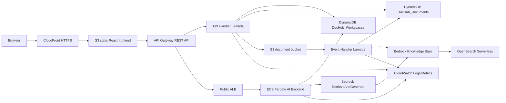

# DocHub AI Architecture

## System Diagram

## Request Flow

1. User opens the CloudFront HTTPS URL and loads the React app from S3.
2. User selects a demo tenant. The frontend stores `tenant_id` locally and sends it as `X-Tenant-Id`.
3. API Gateway routes workspace and upload requests to API Handler Lambda.
4. API Handler Lambda validates tenant context against DynamoDB before returning or mutating workspace/document data.
5. Upload initialization creates a `PENDING` document row, writes Bedrock sidecar metadata, and returns a presigned S3 POST.
6. S3 ObjectCreated invokes Event Handler Lambda after the browser upload completes.
7. Event Handler Lambda moves the document to `UPLOADED`, starts a Bedrock ingestion job, then moves it to `INDEXING`.
8. Bedrock ingestion events move the document to `READY` or `ERROR`.
9. Chat requests go through API Gateway to ALB and the ECS FastAPI backend.
10. ECS validates workspace ownership, calls Bedrock RetrieveAndGenerate with a workspace metadata filter, and returns an answer plus sources.

## Operational Flow

- GitHub Actions deploys through AWS OIDC.
- Terraform owns AWS infrastructure.
- The workflow builds and pushes the AI backend image to ECR, applies Terraform, builds the frontend with the deployed API URL, syncs S3, and invalidates CloudFront.
- CloudWatch dashboard and alarms provide evidence for the optional Full Observability capability.

## Mandatory Capability Mapping

| W7 capability | Implementation |
| --- | --- |
| 1. User-facing entry | CloudFront public HTTPS URL serving S3 static frontend |
| 2. Application compute | Lambda for metadata/upload APIs, ECS Fargate for AI backend |
| 3. AI / ML feature | Bedrock Knowledge Base and RetrieveAndGenerate |
| 4. Data persistence | DynamoDB workspaces and documents tables |
| 5. Object storage | S3 document bucket and frontend bucket |
| 6. Network foundation | VPC, public/private subnets, security groups, ALB |
| 7. Identity and access | IAM least privilege roles, demo tenant context, server-side ownership checks |
| 8. Optional observability | CloudWatch dashboard, custom metrics, alarms, Logs Insights query |
