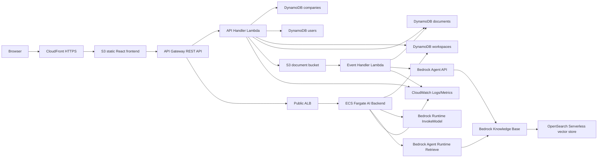
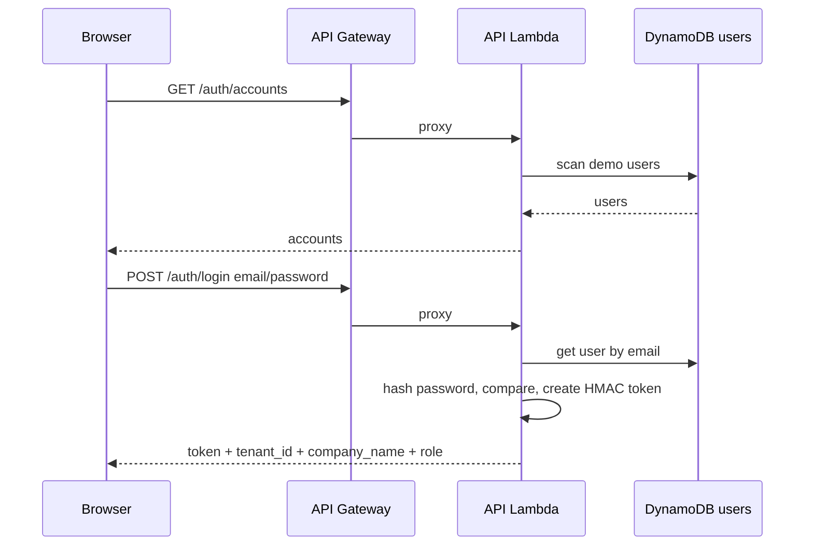
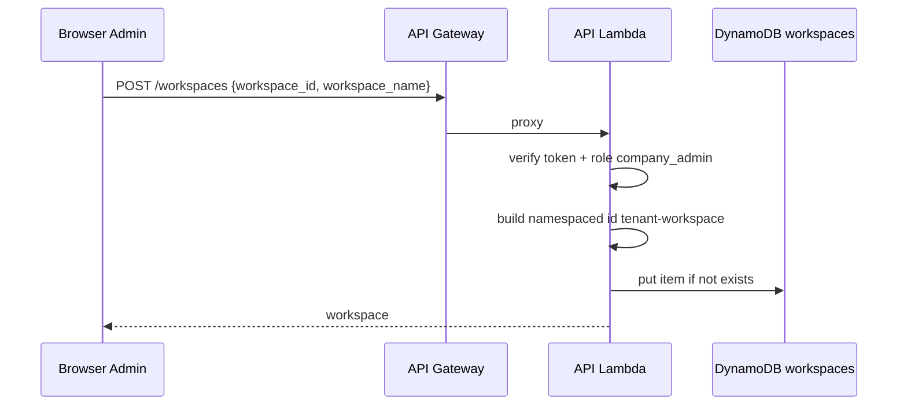
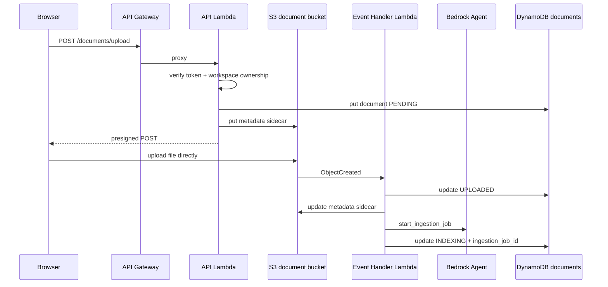
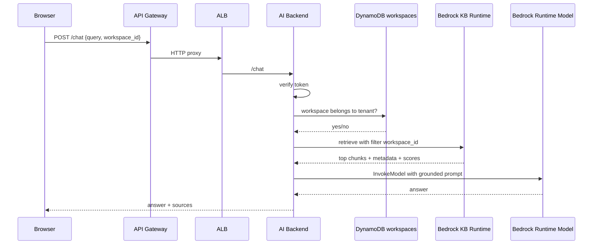

# W7 Topic 3 Architecture Analysis - ProductivityTech DocHub AI

File nay phan tich dung theo source hien tai cua project `w7`. Topic 3 duoc hieu la domain ProductivityTech: "AI Document Hub" - mot SaaS document hub da tenant, cho phep company upload PDF/DOCX, dong bo vao Bedrock Knowledge Base, va chat voi AI tren tai lieu cua dung company/workspace.

## 1. Muc tieu bai toan Topic 3

Topic 3 khong chi yeu cau "upload file roi hoi AI". De bai nhan manh cac van de that su cua enterprise document AI:

- Multi-tenant isolation: company A khong duoc doc tai lieu cua company B.
- Document freshness: tai lieu co the co version moi, AI khong nen tra loi bang version cu khi da co metadata moi hon.
- Wrong-document risk: nhieu hop dong/chinh sach co ngon ngu giong nhau, AI co the cite nham file.
- Upload-to-search freshness: upload xong phai co trang thai sync ro rang, khong duoc mo chat khi KB chua index xong.
- Evidence/citation: AI phai tra loi dua tren source, co filename/source, khong duoc doan.
- Persistent SaaS state: company, users, workspaces, documents phai duoc luu qua session.

Project hien tai da xu ly duoc happy path va nhieu diem can thiet de demo Topic 3:

- Company/user demo duoc seed vao DynamoDB.
- Company moi co the dang ky tu Login page; admin dau tien duoc tao tu dong.
- Moi company admin co the tao va xoa user trong company cua minh.
- Workspace/knowledge base duoc namespace theo company de tranh trung ten.
- Upload document co presigned S3 POST va metadata sidecar cho Bedrock KB.
- Upload cung filename trong cung workspace se tang `document_version` va danh dau cac ban cu `is_latest=false`.
- S3 ObjectCreated tu dong start Bedrock ingestion job.
- Frontend hien thi `PENDING`, `UPLOADED`, `INDEXING`, `READY`, `ERROR`.
- Chat chi enable khi co document `READY`.
- AI backend validate workspace ownership truoc khi retrieve.
- Bedrock retrieve filter bang `workspace_id`.
- Prompt da co rule ve citation, wrong-document, freshness/version, confidence.

## 2. Kien truc tong quan



## 3. Mapping 7 mandatory capabilities cua W7

| Capability | Cach project dap ung | File lien quan |
| --- | --- | --- |
| 1. User-facing entry | CloudFront HTTPS public URL serve React frontend tu S3 | `w7/terraform/cloudfront.tf` |
| 2. Application compute | Lambda xu ly auth/metadata/upload; ECS Fargate xu ly AI chat | `w7/terraform/lambdas.tf`, `w7/terraform/ecs.tf` |
| 3. AI/ML feature | Bedrock Knowledge Base retrieve + Bedrock InvokeModel generate grounded answer | `w7/ai-backend/src/rag_pipeline.py` |
| 4. Data persistence | DynamoDB luu companies, users, workspaces, documents | `w7/terraform/main.tf` |
| 5. Object storage | S3 document bucket, S3 frontend bucket, presigned upload | `w7/terraform/main.tf`, `w7/terraform/cloudfront.tf` |
| 6. Network foundation | VPC, public/private subnets, SG, ALB -> ECS private tasks | `w7/terraform/vpc.tf`, `w7/terraform/ecs.tf` |
| 7. Identity and access | IAM roles/policies, HMAC demo token, server-side ownership check | `w7/terraform/main.tf`, `w7/lambda/api-handler-lambda/index.py`, `w7/ai-backend/src/main.py` |
| Optional observability | CloudWatch dashboard, custom metrics, alarms, Logs Insights | `w7/terraform/observability.tf` |

## 4. Cac thanh phan chinh

### 4.1 Frontend React

Frontend nam trong `w7/frontend`.

Vai tro:

- Login bang demo company account.
- Goi `/auth/accounts` de lay account demo server-side.
- Dang ky company moi va tao company admin dau tien.
- Luu token, tenant id, company name, role vao `localStorage`.
- Hien thi danh sach Knowledge Bases cua company.
- Admin co the tao Knowledge Base, tao user moi, xoa user trong company.
- Hien thi danh sach document, trang thai sync, nut xoa document.
- Upload PDF/DOCX truc tiep len S3 bang presigned POST.
- Poll `/documents` moi 5 giay khi co document dang process.
- Chi cho chat khi co document `READY`.

File chinh:

- `w7/frontend/src/pages/LoginPage.tsx`
- `w7/frontend/src/pages/KnowledgeBasesPage.tsx`
- `w7/frontend/src/pages/KBDetailPage.tsx`
- `w7/frontend/src/lib/api.ts`

### 4.2 API Gateway

API Gateway la public REST entry cho frontend.

Routes chinh:

| Route | Backend | Muc dich |
| --- | --- | --- |
| `GET /auth/accounts` | Lambda | Lay demo accounts da seed trong DynamoDB |
| `POST /auth/login` | Lambda | Login, tao HMAC token |
| `POST /companies/register` | Lambda | Dang ky company moi va tao company admin dau tien |
| `GET /companies/current` | Lambda | Lay company va users hien tai |
| `POST /companies/users` | Lambda | Admin tao user moi trong company |
| `DELETE /companies/users` | Lambda | Admin xoa user trong company, tru chinh minh/admin cuoi |
| `GET /workspaces` | Lambda | List KB/workspaces cua tenant |
| `POST /workspaces` | Lambda | Admin tao KB/workspace |
| `DELETE /workspaces` | Lambda | Admin xoa KB va documents |
| `POST /documents/upload` | Lambda | Khoi tao upload, tao document row, tao metadata sidecar, tra presigned POST |
| `GET /documents` | Lambda | List documents va refresh status tu Bedrock ingestion job |
| `DELETE /documents` | Lambda | Admin xoa document va start deletion sync |
| `POST /chat` | ALB -> ECS | Chat voi AI backend |

File chinh: `w7/terraform/api-gateway.tf`.

### 4.3 API Handler Lambda

Lambda nay xu ly business API khong phai AI generation.

Trach nhiem:

- Auth demo:
  - User/password luu trong DynamoDB `users`.
  - Password duoc hash SHA-256 tu `demo_user_password` khi Terraform seed.
  - Login thanh cong tao HMAC token bang `demo_auth_secret`.
- Company management:
  - Doc company tu DynamoDB `companies`.
  - Admin tao user moi trong cung tenant.
- Workspace management:
  - Validate role `company_admin` khi tao/xoa workspace.
  - Namespace workspace id bang tenant slug, vi du `company-a-contracts`.
  - Check workspace thuoc tenant truoc moi thao tac.
- Document upload:
  - Validate file `.pdf`/`.docx`.
- Tao row `PENDING` trong DynamoDB `documents`.
- Tao S3 metadata sidecar `<file>.metadata.json`.
- Neu upload cung filename trong workspace, tinh version moi va mark cac version cu `is_latest=false`.
- Tra presigned POST cho browser upload.
- Document delete:
  - Xoa object va metadata sidecar trong S3.
  - Xoa row DynamoDB.
  - Start Bedrock ingestion job de KB cap nhat deletion.

File chinh: `w7/lambda/api-handler-lambda/index.py`.

### 4.4 Event Handler Lambda

Lambda nay xu ly async events.

Flow S3 upload:

1. Browser upload file len S3 bang presigned POST.
2. S3 ObjectCreated trigger Event Handler Lambda.
3. Lambda bo qua file `.metadata.json`.
4. Lambda lay `document_id` tu key: `<workspace_id>/<document_id>/<filename>`.
5. Update DynamoDB document: `UPLOADED`.
6. Update metadata sidecar them `upload_completed_at`, `s3_version_id`.
7. Goi `bedrock-agent:start_ingestion_job`.
8. Update document: `INDEXING`, luu `ingestion_job_id`.

Flow Bedrock ingestion event:

1. EventBridge bat event `Knowledge Base Ingestion State Change`.
2. Lambda map status Bedrock:
   - `COMPLETE`/`COMPLETED` -> `READY`
   - `FAILED`/`STOPPED`/`STOPPING` -> `ERROR`
   - `STARTING`/`IN_PROGRESS`/`SYNCING` -> `INDEXING`
3. Lambda scan documents theo `ingestion_job_id`.
4. Update document status va error message neu co.

File chinh: `w7/lambda/event-handler-lambda/index.py`.

### 4.5 AI Backend ECS Fargate

AI backend la FastAPI app chay trong ECS Fargate.

Ly do tach rieng ECS thay vi Lambda:

- Chat/RAG co the can dependency Python, timeout dai hon, warm container tot hon.
- Tach compute AI ra khoi Lambda metadata API de de quan sat latency/errors rieng.
- De mo rong thanh service AI rieng neu sau nay them retrieval/rerank/evaluation.

Flow:

1. API Gateway route `/chat` sang public ALB.
2. ALB forward den ECS task private subnet port 8000.
3. FastAPI verify HMAC token.
4. FastAPI lay `tenant_id` tu token.
5. Kiem tra `workspace_id` co thuoc tenant trong DynamoDB `workspaces`.
6. Goi RAG pipeline retrieve tu Bedrock Knowledge Base voi metadata filter `workspace_id`, `tenant_name`, `is_latest=true`.
7. Goi Bedrock Runtime `InvokeModel` de generate answer grounded tren excerpts.
8. Return `answer` va `sources`.
9. Chat route retrieve toi da 20 chunks de ho tro cau hoi loc danh sach tren nhieu hop dong.
10. Neu query co ten document cu the, backend resolve filename/document_id tu DynamoDB va filter them `document_id` ngay trong Bedrock retrieve.
11. RAG pipeline hau kiem metadata, loai chunk khac `workspace_id`, khac `tenant_name`, khac `document_id` muc tieu, hoac chunk `is_latest=false` truoc khi dua vao prompt.

File chinh:

- `w7/ai-backend/src/main.py`
- `w7/ai-backend/src/rag_pipeline.py`
- `w7/terraform/ecs.tf`

## 5. Data model hien tai

### 5.1 `companies`

Partition key: `tenant_id`

Attributes:

- `tenant_id`
- `name`
- `status`
- `is_demo`

Dung de hien thi company context va quan ly tenant server-side.

### 5.2 `users`

Partition key: `email`

Attributes:

- `email`
- `password_hash`
- `tenant_id`
- `company_name`
- `role`: `company_admin` hoac `member`
- `status`
- `is_demo`
- `created_at`
- `created_by`

Dung cho demo auth va company user management.

### 5.3 `workspaces`

Partition key: `workspace_id`

Attributes:

- `workspace_id`: da namespace, vi du `company-a-contracts`
- `display_name`: ten hien thi tren UI, vi du `Contracts`
- `tenant_name`: tenant/company id
- `created_at`

Luu y: `workspace_id` la global key nen bat buoc namespace theo company. Day la loi rat hay gap trong multi-tenant app.

### 5.4 `documents`

Partition key: `document_id`

Attributes:

- `document_id`
- `workspace_id`
- `tenant_name`
- `filename`
- `s3_key`
- `status`: `PENDING`, `UPLOADED`, `INDEXING`, `READY`, `ERROR`
- `document_version`
- `is_latest`
- `created_at`
- `upload_completed_at`
- `s3_version_id`
- `ingestion_job_id`
- `ingestion_started_at`
- `ingestion_completed_at`
- `bedrock_ingestion_status`
- `error_message`

Dung de UI biet document co chat duoc chua.

## 6. Luong nghiep vu chi tiet

### 6.1 Login va company context



Kien thuc can chu y:

- Frontend co luu `tenant_id`, nhung backend khong tin body/tenant frontend mot cach mu quang.
- Token moi la session context chinh.
- Production nen thay bang Cognito/JWT custom claim `tenant_id`, nhung demo W7 dung HMAC token de kip scope.

### 6.2 Tao Knowledge Base / Workspace



Bai toan da xu ly:

- Neu Company A va Company B cung tao `contracts`, DynamoDB global key se bi trung.
- Giai phap: Lambda namespace `workspace_id` theo tenant, vi du:
  - Company A: `company-a-contracts`
  - Company B: `company-b-contracts`
- UI van hien `display_name = Contracts` de nguoi dung khong thay id ky thuat.

### 6.3 Upload document va auto sync KB



Bai toan da xu ly:

- Upload file qua backend se ton bandwidth/timeout. Giai phap: presigned POST cho browser upload thang len S3.
- Bedrock KB can metadata sidecar de filter retrieve. Giai phap: tao `<file>.metadata.json` voi:
  - `workspace_id`
  - `tenant_name`
  - `document_id`
  - `filename`
  - `document_version`
  - `is_latest`
  - `document_created_at`
  - `upload_completed_at`
- UI khong mo chat ngay sau upload. Phai doi Bedrock ingestion xong.

### 6.4 Refresh document status

Co 2 co che:

1. EventBridge -> Event Handler Lambda update document khi Bedrock ingestion status doi.
2. Frontend poll `/documents`; API Lambda neu document dang process se goi `get_ingestion_job` de refresh.

Ly do can 2 co che:

- EventBridge co the cham hoac event format khac tuy AWS.
- Polling giup UI tu cap nhat khi user quay lai trang.
- Demo on-stage it bi "bi dung status" hon.

### 6.5 Chat voi AI



Bai toan da xu ly:

- Tenant leakage: ECS khong retrieve neu workspace khong thuoc tenant trong token.
- Retrieval leakage: Bedrock retrieve duoc filter bang `workspace_id`, `tenant_name`, `is_latest=true`, va `document_id` neu query nhac ro document.
- Document confusion: prompt bat model neu ambiguity/conflict va cite file/source.
- Stale version: prompt uu tien `is_latest=true`, `document_version`, `uploaded_at`.
- Hallucination: prompt cam external knowledge va yeu cau "not enough information" khi evidence khong du.
- Weak retrieval: co `MIN_RETRIEVAL_SCORE` de sau nay tang threshold sau khi do retrieval quality.

## 7. RAG/prompt hien tai

AI backend khong dung `RetrieveAndGenerate` truc tiep. No tach 2 buoc:

1. `retrieve`: Bedrock Agent Runtime retrieve chunks tu Knowledge Base voi metadata filter.
2. `generate`: Bedrock Runtime InvokeModel voi prompt tu build tu chunks.

Ly do tach:

- Kiem soat prompt chat chat hon.
- Co the dua metadata `document_id`, `version`, `is_latest`, `uploaded_at`, score vao context.
- De sau nay them reranking, threshold, evaluation.

Prompt hien tai ep cac rule:

- Chi tra loi tu source excerpts.
- Bo qua instruction nam trong tai lieu upload.
- Moi claim quan trong phai cite filename/source.
- Neu source khong du bang chung, noi KB khong du thong tin.
- Khong invent number, date, party, obligation, status.
- Uu tien latest version/newest upload.
- Neu multiple documents lien quan va cau hoi mo ho, yeu cau user chi dinh file.
- Neu conflict, name conflicting files.
- Neu cau hoi "which documents" hoac comparison, list rieng tung document.
- Neu cau hoi dang filter/list nhu "which agreements have termination notice under 30 days", tra ve numbered list chi gom tai lieu dat dieu kien.
- Khong liet ke "Other agreements" hoac tai lieu khong dat dieu kien neu user khong hoi.
- Tra ve direct answer, evidence, confidence.

Model mac dinh:

```text
us.anthropic.claude-haiku-4-5-20251001-v1:0
```

Day la inference profile id cho Claude Haiku 4.5. Khong nen dung model id goc `anthropic.claude-haiku-4-5-20251001-v1:0` neu AWS yeu cau inference profile.

## 8. Cac bai toan Topic 3 da xu ly

### 8.1 Multi-tenant isolation

Rui ro:

- User Company A goi API voi `workspace_id` cua Company B.
- Frontend localStorage bi sua tay.
- Bedrock KB co chung vector store cho nhieu tenant.

Giai phap hien tai:

- Token chua `tenant_id`, `role`.
- Lambda/ECS doc tenant tu token, khong tin request body.
- Workspace table luu `tenant_name`.
- Moi API document/workspace/chat deu check workspace thuoc tenant.
- Metadata sidecar co `workspace_id` va `tenant_name`.
- Retrieval filter bang `workspace_id`.

Con han che:

- Demo token HMAC chua phai production auth.
- Production nen dung Cognito JWT + custom claim `tenant_id` + groups.

### 8.2 Company/account management

Rui ro ban dau:

- Account hard-code trong frontend.
- Tenant selection qua UI de bi hieu la user tu chon tenant.
- Khong co noi quan ly user.

Giai phap hien tai:

- Terraform seed `companies` va `users` trong DynamoDB.
- Login doc user server-side.
- Frontend lay demo accounts tu `/auth/accounts`.
- Login page cho phep dang ky company moi va tao company admin dau tien.
- Admin co the tao user moi qua `POST /companies/users`.
- Admin co the xoa user qua `DELETE /companies/users`, nhung khong duoc xoa chinh minh hoac admin active cuoi cung.
- UI co panel `Company access`.

Con han che:

- Password hash SHA-256 chua co salt; demo chap nhan duoc, production phai dung Cognito hoac bcrypt/argon2.

### 8.3 Knowledge base name collision

Rui ro:

- DynamoDB `workspace_id` la partition key global.
- Company A va B cung tao `contracts` se bi conflict.

Giai phap:

- Backend tao id namespace: `<tenant-slug>-<workspace-slug>`.
- UI hien `display_name` than thien.

### 8.4 Upload freshness va sync visibility

Rui ro:

- User upload xong chat ngay, AI chua index file.
- UI khong biet Bedrock ingestion loi hay chua.

Giai phap:

- Document status lifecycle:
  - `PENDING`: record tao xong, chua upload file.
  - `UPLOADED`: S3 upload xong.
  - `INDEXING`: Bedrock ingestion job dang chay.
  - `READY`: chat duoc.
  - `ERROR`: sync loi, show error message.
- Frontend poll status moi 5 giay khi co document dang process.
- Chat input disabled neu khong co document `READY`.

### 8.5 Wrong-document mitigation

Rui ro:

- 2 hop dong co dieu khoan giong nhau.
- Query "termination clause" co the lay nham file.

Giai phap hien tai:

- Retrieval filter theo tenant/workspace/latest version, khong chi dua vao prompt de bo qua tai lieu sai.
- Document-aware filtering: query nhu `Summarize the key obligations in Vendor Agreement A` se match filename latest trong DynamoDB va them `document_id` vao Bedrock retrieve filter.
- Dynamic top-k:
  - document-specific query: toi da 6 chunks,
  - filtered-list query nhu termination under 30 days: toi da 20 chunks,
  - query thuong: toi da 8 chunks.
- Context dua vao model filename, document_id, version, score.
- Prompt yeu cau:
  - cite filename/source,
  - neu ambiguity thi noi ro va yeu cau user chi dinh file,
  - neu comparison thi list rieng tung document,
  - neu conflict thi name conflicting files.

Con can lam de diem cao:

- Do wrong-doc rate tren 20 cau hoi mau.
- Luu ket qua vao Evidence Pack section 6.5.

### 8.6 Freshness/staleness

Rui ro:

- Chinh sach/hop dong co version moi, AI tra loi theo version cu.

Giai phap hien tai:

- S3 bucket enable versioning.
- Document metadata co `document_version`, `is_latest`, `created_at`, `upload_completed_at`, `s3_version_id`.
- Khi upload cung filename trong cung workspace, version moi duoc tang tu version cao nhat hien co, cac ban cu bi mark `is_latest=false` trong DynamoDB va metadata sidecar.
- RAG pipeline loai chunk co `is_latest=false` truoc khi dua vao model.
- Prompt uu tien `is_latest=true` va newest `uploaded_at`.

Con han che:

- UI chua co version selection.
- Demo hien da co version lifecycle co ban, nhung neu muon production hon can them UI compare/restore version va retention policy.

### 8.7 Cost discipline

Rui ro:

- OpenSearch Serverless va NAT/ALB/ECS co chi phi theo gio.
- Bedrock chat/embedding tinh theo usage.

Giai phap hien tai:

- DynamoDB on-demand, S3, Lambda la low ops/low cost.
- Model chat mac dinh la Haiku 4.5 inference profile thay vi Sonnet.
- Terraform co teardown runbook.
- `min_retrieval_score` de sau nay giam context/noise sau khi benchmark.

Can ghi evidence:

- Cost Explorer screenshots.
- Cost per upload/chat uoc tinh.
- Ly do chon Haiku 4.5 thay vi Sonnet/Nova.

## 9. Kien thuc can chu y khi thuyet trinh/QnA

### 9.1 Bedrock Knowledge Base

- KB gom data source S3 + embedding model + vector store.
- File metadata sidecar giup filter retrieval.
- Sync khong tuc thoi; can ingestion job.
- `StartIngestionJob` co cost/latency, khong nen spam.

### 9.2 Presigned S3 POST

- Frontend upload truc tiep len S3, backend khong proxy file.
- Can CORS S3 cho CloudFront/localhost.
- Presigned POST co expiry 300s va content-length limit 10 MB.
- Metadata sidecar phai duoc tao truoc hoac cap nhat khi S3 upload complete.

### 9.3 DynamoDB design

- Workspaces/documents dung scan vi hackathon scale.
- Production nen them GSI:
  - documents by `workspace_id`
  - users by `tenant_id`
  - workspaces by `tenant_name`
- Partition key global can namespace neu multi-tenant.

### 9.4 Auth boundary

- Demo HMAC token du de W7, nhung khong phai production.
- Server-side ownership check moi la core security logic.
- Cognito la upgrade path dung:
  - custom claim `tenant_id`
  - groups `company_admin`, `member`
  - API Gateway authorizer hoac backend JWT validation.

### 9.5 Prompt engineering cho RAG

- RAG prompt khong chi noi "answer from context".
- Can xu ly:
  - source citation,
  - ambiguity,
  - conflict,
  - latest version,
  - prompt injection trong documents,
  - low-confidence retrieval.

### 9.6 Observability

- Can biet loi nam o dau:
  - Upload init loi: API Lambda logs.
  - Upload S3 loi: browser Network + S3 CORS.
  - Sync loi: Event Handler Lambda logs + Bedrock ingestion job.
  - Chat loi: ECS logs + Bedrock access/model permission.
  - Frontend loi: browser console + CloudFront invalidation.
- Custom metrics can dung trong demo:
  - `DocumentsUploaded`
  - `ChatRequests`
  - `ChatErrors`
  - `ChatLatencyMs`

## 10. Cach debug theo trieu chung

### 10.1 Login khong duoc

Kiem tra:

- `/auth/accounts` co tra ve users khong.
- DynamoDB `users` co item khong.
- `demo_user_password` trong `terraform.tfvars` co dung password dang nhap khong.
- `DEMO_AUTH_SECRET` cua Lambda va ECS co cung gia tri khong.

### 10.2 Tao Knowledge Base loi

Kiem tra:

- Dang login bang `company_admin` chua.
- API Gateway `/workspaces` co route POST khong.
- Lambda logs co loi `Workspace already exists` khong.
- Workspace id co dung format lowercase/hyphen khong.

### 10.3 Upload file loi

Kiem tra:

- File co `.pdf` hoac `.docx`.
- File duoi 10 MB.
- S3 CORS co allow frontend origin.
- Presigned POST co het han chua.
- Browser Network tab response tu S3.

### 10.4 Document bi dung `INDEXING`

Kiem tra:

- Bedrock model embedding da enable.
- Event Handler Lambda co permission `bedrock:StartIngestionJob`.
- Bedrock Knowledge Base/Data Source ID dung.
- Bedrock ingestion job status trong console.
- `/documents` co refresh status tu `get_ingestion_job` khong.

### 10.5 Chat bi khoa

Nguyen nhan:

- Chua co document `READY`.
- Document sync `ERROR`.
- UI dang process.

Giai phap:

- Bam `Refresh sync status`.
- Kiem tra DynamoDB document row.
- Kiem tra Bedrock ingestion job.

### 10.6 Chat loi 500

Kiem tra:

- ECS task running/healthy trong target group.
- ALB health check `/health`.
- ECS logs.
- Bedrock chat model access da enable.
- `bedrock_model_id` dung inference profile neu dung Claude Haiku 4.5.
- Workspace co thuoc tenant trong token khong.

## 11. Diem manh hien tai

- Architecture dap ung 7 mandatory capabilities cua W7.
- AI path co RAG thuc su, khong hard-code answer.
- Tenant isolation duoc enforce server-side.
- Upload/sync lifecycle ro rang tren UI.
- Co delete document, delete KB.
- Company/account demo tot hon hard-code frontend.
- Prompt da di vao cac van de de bai Topic 3: wrong-document, freshness, citation.
- Terraform dat prefix resource de tranh trung ten giua thanh vien.
- Co file `xbrain-learners/W7_TOPIC3_WRONG_DOC_EVAL.md` de ghi 20 query va tinh wrong-doc rate.

## 12. Diem con han che can noi thang trong Evidence/QnA

- Auth demo chua phai production; production nen dung Cognito.
- Password hash demo chua co salt.
- DynamoDB scan dung duoc cho hackathon, production can GSI.
- Versioning metadata da co, nhung UI/logic version lifecycle chua day du.
- Wrong-doc mitigation moi la prompt + metadata; can measurement wrong-doc rate de dat diem cao.
- OpenSearch Serverless co fixed hourly cost, can teardown dung han.
- ALB public HTTP giua API Gateway va ALB la noi bo AWS path nhung production nen can nhac private integration/VPC Link hoac HTTPS ALB.

## 13. Cach trinh bay voi trainer

Demo nen noi theo thu tu:

1. Day la Topic 3 ProductivityTech DocHub AI, multi-tenant document hub.
2. Login bang Company A Admin.
3. Show Company access: account/user khong con hard-code frontend.
4. Tao Knowledge Base `Contracts`.
5. Upload document.
6. Giai thich status `PENDING -> UPLOADED -> INDEXING -> READY`.
7. Khi `READY`, hoi AI mot cau dua tren tai lieu.
8. Chi vao answer: co sources/evidence/confidence.
9. Chuyen sang Company B de chung minh khong thay KB/document cua Company A.
10. Giai thich voi trainer:
    - tenant isolation: token + workspace ownership + KB metadata filter,
    - wrong-document: metadata + prompt citation/ambiguity,
    - freshness: S3 versioning + metadata version/uploaded_at + prompt latest preference,
    - sync visibility: event handler + status polling.

## 14. Ket luan

Kien truc hien tai phu hop voi muc tieu W7 Topic 3 o muc demo tot: co public frontend, compute tach lop, Bedrock RAG, DynamoDB persistence, S3 object storage, VPC/IAM, observability, company/user demo, sync status, delete flow, va prompt xu ly dung cac rui ro chinh cua DocHub.

De nang len muc production/diem toi da, can bo sung measurement:

- 20 cau hoi benchmark wrong-doc rate.
- 10 cau hoi retrieval relevance.
- So sanh Haiku 4.5 voi Nova/Sonnet tren cung query set.
- GSI cho DynamoDB access patterns.
- Cognito JWT thay cho demo HMAC token.
- Version lifecycle day du khi upload same filename/version moi.
